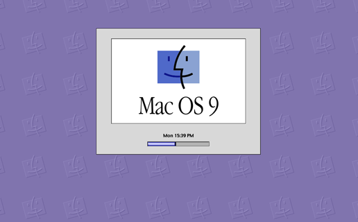

# Mac OS 9 Startup Simulator Widget

Widget for [Übersicht](http://tracesof.net/uebersicht/) that simulates the Mac OS 9 Startup Screen and includes an optional clock. It's scaleable!

## Installation
- Install [Übersicht](http://tracesof.net/uebersicht/) (if not already done)
- Download the [latest release](https://github.com/ericksonstudio/Mac-OS-9-for-Ubersicht/releases)
- Unzip the downloaded file
- Put the extracted folder 'MacOS9.widget' in your Übersicht widgets folder (usually ~/Library/Application Support/Übersicht/widgets)

## Info
Some of the settings you can customize at the top of the index.coffee file...

- `zoom = "120%"` (100% is Apple's original size. 120% looks better on larger screens, but tweak this as your mileage may vary)
- `ostext = "Mac OS 9"` (Change to whatever you want that fits the space)
- `status = "Welcome to Mac OS"` ("Welcome to Mac OS" was the first default screen. `"Starting Up…"` was shown during boot-up.)
- `barwidth = "3%"` (If you want this "stuck" in a static position, put a percentage here)
- `showprogress = true` (`true` = show the progress bar, `false` = hide it)
- `showclock = true` (show the clock instead of the standard startup stuff -- setting `true` will override the `status`, `barwidth` and `showprogress` vars)
- `t24hourtime = false` (`true` = clock uses 24-hour time -- default: `false` = 12-hour time)
- `showbgimg = true` (`true` = shows the widget's tiled background img / `false` = shows your native macOS background)
- `showbgcolor = true` (`true` = shows the widget's background color / `false` = shows your native macOS background)

## New
- `chime = true` (`true` = plays a chime on the quarter hour / `false` = no chime -- default: `true`)
- `soundfile = 'MacOS9.widget/sounds/Temple.aiff'` (location of the chime sound file -- default: `'MacOS9.widget/sounds/Temple.aiff'`)
