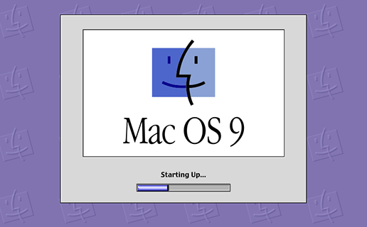

# Mac OS 9 Startup Simulator Widget

Widget for [Übersicht](http://tracesof.net/uebersicht/) that simulates the Mac OS 9 Startup Screen with optional clock, quarter-hour chime, and startup sounds.

## Installation
- Install [Übersicht](http://tracesof.net/uebersicht/) (if not already done)
- Download the [latest release](https://github.com/ericksonstudio/Mac-OS-9-for-Ubersicht/releases)
- Unzip the downloaded file
- Put the extracted folder 'MacOS9.widget' in your Übersicht widgets folder (usually ~/Library/Application Support/Übersicht/widgets)

## Configuration

The widget can be customized by editing the variables at the top of index.coffee.

### Appearance

- `zoom = "120%"`
  Controls the size of the widget. 100% matches Apple's original startup screen size.

- `ostext = "Mac OS 9"`
  Change the operating system text shown beneath the Happy Mac icon.

- `showbgimg = true`
  Shows the widget's tiled background image.

- `showbgcolor = true`
  Shows the widget's background color.

### Standard Startup Screen

- `status = "Welcome to Mac OS"`
  Text displayed beneath the progress bar.

- `barwidth = "3%"`
  Sets the progress bar width.

- `showprogress = true`
  Shows or hides the progress bar.

### Clock Mode

- `showclock = true`
  Replaces the standard startup screen with a live clock.

- `t24hourtime = false`
  Use 24-hour time (true) or 12-hour time (false).

When Clock Mode is enabled, the progress bar becomes a minute-progress indicator.

### Startup Simulation

- `startupBoot = true`
  Enables the simulated Mac startup sequence.

- `startupDuration = 5000`
  Duration of the startup sequence in milliseconds.

- `startupStatus = "Starting Up…"`
  Status message displayed during startup.

- `startupSound = true`
  Plays a startup sound when the widget loads.

- `startupSoundFile = 'MacOS9.widget/sounds/quadra.m4a'`
  Startup sound to play when the widget loads.

### Quarter-Hour Chime

- `chime = true`
  Plays a sound at the top, quarter past, half past, and quarter to each hour.

- `soundfile = 'MacOS9.widget/sounds/Temple.aiff'`
  Sound file used for the quarter-hour chime.

## New in v1.4.0

- Added simulated Mac startup sequence
- Added optional startup sound support
- Added configurable startup duration
- Added configurable startup status text
- Added startup sequence enable/disable switch
- Fixed 12-hour clock display (12:xx PM now displays correctly)
- Added quarter-hour chime support
- Added optional custom chime files
- Fixed chime playback stability issues
- Clock mode progress bar now represents progress through the current minute